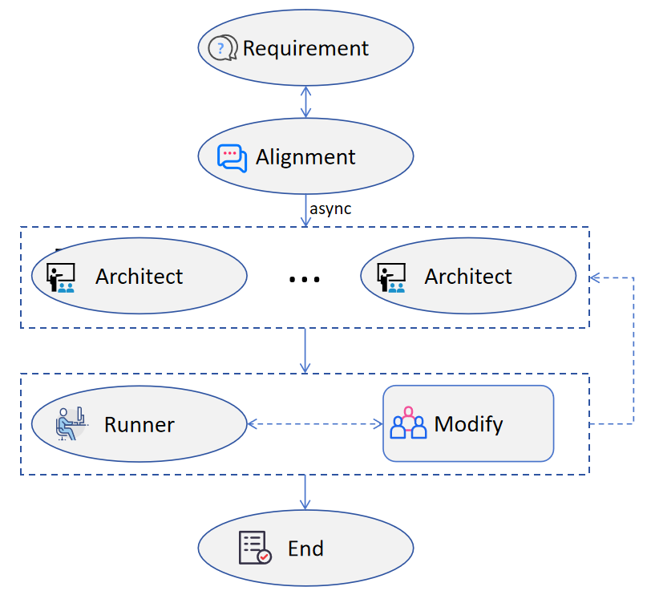
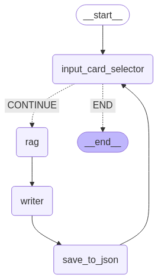

## Algorithm
MooseAgent: 自动化MOOSE代理(集成了一个MOOSE assistant，该模块可以单独拿出来用)
```plaintext
输入（仿真需求）
需求对齐：划分仿真任务，确定每个子文件的名字，对每个仿真任务内的细节进行说明。
### 任务分解
For inpcard in inpcards:
    根据需求定义检索内容，检索相关仿真案例。
    架构师：基于需求、相关仿真案例，给出输入卡基本结构。
### 多轮迭代纠错
    执行输入卡。
    If False:
        if 小于最大纠错次数：
            modify:基于数据库给出错误原因和修改后的输入卡
        else:
            判断是否重复一个错误
            If True：
                回到任务分解步骤，重新攥写输入卡
            else:
                modify:基于数据库给出错误原因和修改后的输入卡
    Else:
        SUCCESS
```


AutoComment: 输入卡自动注释Agent
```plaintext
1.随机挑选一张未注释输入卡，
2.查询输入卡相关APP的说明文档
3.输入说明文档和输入卡
4.输出带注释输入卡。回到1
```

## Getting Started
1. Install

```bash
conda create -n langgraph python=3.12
pip install requirements.txt
```


2. Create a `.env` file.

```bash
cp .env.example .env
```
Now we use deepseek and openAi model, you can use [火山](https://console.volcengine.com/) to get your api-key for free.

Note: Change RUN_PATH you .env file to your path.
### Setup Model

The defaults values for `model` are defined in src/mooseagent/configuration.py:

```yaml
alignment_model: str = "huoshan/deepseek-v3-241226"
architect_model: str = "huoshan/deepseek-r1-250120"
review_writer_model: str = "huoshan/deepseek-v3-241226"  # Defaults to claude-3-7-sonnet-latest
writer_model: str = "huoshan/deepseek-v3-241226"  # Defaults to claude-3-5-sonnet-latest
extracter_model: str = "openai/gpt-4o-mini" # You can change to deepseek v3 if you don't have openai key.
embedding_function: str = "BGE_M3_EmbeddingFunction"  # "BGE_M3_EmbeddingFunction"  # Defaults to BGE_M3_EmbeddingFunction
```

3. Set path: the three paths must set to your own path
```yaml
ABSOLUTE_PATH: str = "/home/zt/workspace/MooseAgent/src" # agent src path
MOOSE_DIR: str = "/home/zt/workspace/mymoose/mymoose-opt" # moose opt path
save_dir: str = "/home/zt/workspace/MooseAgent/run_path" # path to save input card and result
```
4. Run mooseagent

go to graph.py file, change the topic to your task.

```bash
python graph.py
```
You can see the result in save_dir if success. The running log is save in src/log

## Autocomment
This file read case_name_uncommented.txt in database folder. You should change the path in this file to your path. And the annotated code will save in database/comments/, the comment.json will also update.
```bash
python autocomment.py
```
## update database
1. You should first update comment.json or dp_detail.json in src/database.
2. set the configuration.py
```yaml
rag_json_path: str = os.path.join(ABSOLUTE_PATH, "database", "comment.json")  # comment.json
batch_size: int = 1  # batch size for adding documents to the vector store
PERSIST_DIRECTORY: str = os.path.join(
    ABSOLUTE_PATH, "database", embedding_function + "_faiss_inpcard"
) # comment.json corresponding to ..._inpcard, dp_detail.json corresponding to ..._dp
```
3. run load_vector_database.py. It will update incrementally.
```bash
python load_vector_database.py
```

